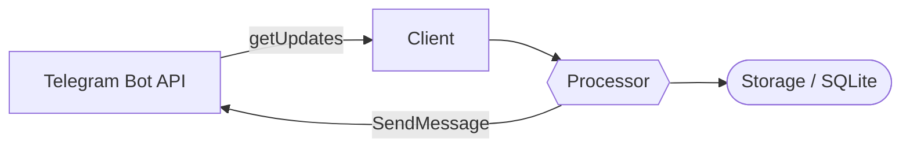

# TelegramGoBot

A Telegram bot written in Go for saving links and retrieving a random saved page. Built over the course of a month while learning Go

## About the project / what I learned

This is a learning project — I built it to get hands-on practice with Go. Along the way I learned and applied:

- **Working with the Telegram Bot API** — a custom HTTP client built on top of the standard `net/http` (no third-party SDKs), long polling via the `getUpdates` method
- **Interface-based architecture** — the code is split into layers (client → event processor → consumer → storage), where each layer only depends on an interface, not a concrete implementation
- **Go module organization** — package structure, `go.mod`, resolving import name collisions between packages that share the same package name
- **Error handling and wrapping** — a custom error-wrapping helper (`lib/e`) for readable error chains, `errors.Is` for checking specific error types
- **Working with databases** — SQLite via `database/sql`, parameterized SQL queries, schema initialization on startup
- **Command-line flags** — using `flag` to pass the bot token at startup
- **Hashing** — `crypto/sha1` for checking whether a saved page already exists
- **Debugging real runtime issues** — panics (nil pointer dereference), build issues (cgo vs. no cgo), network timeouts and how to diagnose them

## Architecture



- **Client** (`clients/telegram`) — talks to the Telegram Bot API over HTTP
- **Processor** (`events/telegram`) — turns raw updates into events and runs commands (`/start`, `/help`, `/rnd`, saving a link)
- **Storage** (`storage`) — persists saved links (SQLite)
- **Consumer** (`consumer`) — the main loop: fetch events → process events, in batches

## Features

- Send the bot a link — it saves it
- `/rnd` — get a random saved link (it's removed from the list once shown)
- `/help` — list of commands
- `/start` — welcome message

---

## 1. Prerequisites

The only thing you need is **Go** (version 1.21 or newer)

Download: https://go.dev/dl/

Check that it's installed:
```
go version
```
It should print something like `go version go1.26.x windows/amd64`

> No extra compilers (GCC, MSYS2, etc.) are required — the project uses a pure-Go SQLite driver with no cgo dependency

---

## 2. Creating your own Telegram bot and getting a token

1. Open Telegram and find **@BotFather**
2. Send `/newbot`
3. Pick a display name (anything) and a username (must end with `bot`, e.g. `my_reader_bot`)
4. BotFather will send you a token that looks like:
   ```
   8780475508:AAFH5xxxxxxxxxxxxxxxxxxxxxxxxxxxxx
   ```
5. **Never share this token publicly** (GitHub, chats, screenshots) — anyone with it can control your bot. If you accidentally leak it, revoke it immediately in BotFather: `/mybots` → select your bot → **Bot Settings → API Token → Revoke current token**, then generate a new one

---

## 3. Running the bot

Open a terminal in the project folder:

```
go build
```

Then run it, passing your token:

**Windows (PowerShell):**
```powershell
.\TestGOBot.exe -tg-bot-token 'YOUR_TOKEN'
```

**Linux / macOS:**
```bash
./TestGOBot -tg-bot-token 'YOUR_TOKEN'
```

**Or from your IDE's built-in terminal (GoLand / VS Code):**

Open the terminal panel inside your IDE (in GoLand: **View → Tool Windows → Terminal**, or the **Terminal** tab at the bottom; in VS Code: **Terminal → New Terminal**) and run the same commands as above:

```
go build
```
```powershell
.\TestGOBot.exe -tg-bot-token 'YOUR_TOKEN'
```
*(use `./TestGOBot -tg-bot-token 'YOUR_TOKEN'` on Linux/macOS)*

If everything went well, you'll see:
```
starting telegram bot
```

Now message your bot on Telegram with `/start` to confirm it's responding

---

## 4. Common errors and how to fix them

### Error: `dial tcp 149.154.166.110:443: connectex: ...` / the bot hangs and never responds

This means your network/ISP is blocking access to `api.telegram.org` (common in some countries)

**Fix:** turn on a system-wide VPN (not a browser extension — an app like Windscribe, ProtonVPN, or Cloudflare WARP), wait until it shows "Connected", and run the bot again while it's active

You can check connectivity directly:
```powershell
curl.exe https://api.telegram.org
```
If you get an HTML response (even a 302/404 error) — the connection works. If it times out / says "Could not connect to server" — the VPN isn't connected or isn't working

### Error: `token is not specified`

You forgot to pass the `-tg-bot-token` flag, or it's empty. Check your run command — the token must follow the flag, wrapped in quotes

### Error when saving the first link: `no such table: pages` (or a similar database error)

The table hasn't been created yet. Make sure storage initialization (e.g. a `storage.Init(...)` call) runs before the consumer loop starts in `main.go`

### `go build` fails

Make sure that:
1. You have a recent version of Go installed (`go version`)
2. You're running the command from the project's root folder (where `go.mod` lives)
3. Try running:
   ```
   go mod tidy
   ```
   and build again

### Something else isn't working

Please describe the exact error message — it's hard to diagnose "it doesn't work" without details

---

## 5. Project structure (brief)

```
clients/telegram/   — HTTP client for the Telegram Bot API
consumer/           — event fetch/process loop
events/             — event and command definitions
lib/e/              — error wrapping helper
storage/            — link storage (SQLite)
main.go             — entry point
```
